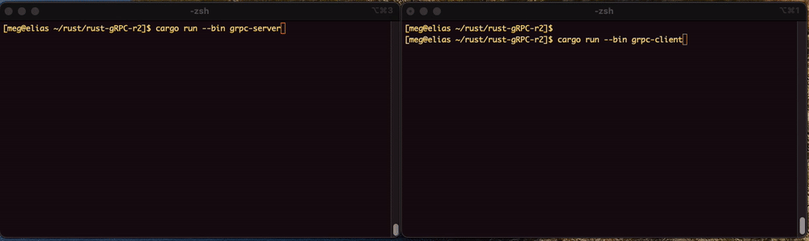

# Rust gRPC implementation

## Table of Contents

- [Motivation](#motivation)
- [Directory Structure](#directory-structure)
- [Start Project](#start-project)
- [Architecture](#architecture)
   - [Proto](#proto)
   - [build.rs](#buildrs)
   - [OUT_DIR Problem](#out_dir-problem)
   - [Dependencies Problem](#dependencies-problem)

- [Appendix](#appendix)  

---
## How to test

<!--

-->

(first please build the packages by going through the instruction below).

After your build ```cargo build``` at the project root is successful, open a terminal and type in 

```sh 
$ cargo run --bin grpc-server
    Finished `dev` profile [unoptimized + debuginfo] target(s) in 0.44s
     Running `target/debug/grpc-server`
gRPC Server listening on [::1]:50051

```
at the project root. 

Open another terminal and type in 


```sh

$ cargo run --bin grpc-client
    Finished `dev` profile [unoptimized + debuginfo] target(s) in 0.16s
     Running `target/debug/grpc-client`
Response = Response { metadata: MetadataMap { headers: {"content-type": "application/grpc", "date": "Mon, 01 Dec 2025 10:14:53 GMT", "grpc-status": "0"} }, message: HelloReply { message: "Hello Mia!" }, extensions: {} }
```

If successful, it returns a Response above. 


---
## Motivation

I would like to understand how Rust works with gRPC. 

We will create 

- greeting server
- greeting client

and let client communicate with server via gRPC. 

---
## Directory Structure


```sh 
$ tree . -L 3
.
├── Cargo.lock
├── Cargo.toml
├── LICENSE
├── README
├── README.md
├── RUST_GRPC
├── grpc-client
│   ├── Cargo.toml
│   └── src
│       └── main.rs
├── grpc-server
│   ├── Cargo.toml
│   └── src
│       └── main.rs
├── proto
│   └── hello.proto
├── proto-defs
│   ├── Cargo.toml
│   ├── build.rs
│   └── src
│       ├── generated
│       └── lib.rs
...
```


---
## Start Project 

We will use ```cargo``` to create a rust project. We need 4 directories. 

1. grcp-client
2. grcp-server
3. proto
4. prroto-defs


It sounds redundant, and may be wrong, but we need ```Cargo.toml``` in all package directories,

- grpc-client
- grpc-server
- proto-defs

in addition to the project root. So, first create a project for each. 

First at the project root
```sh 
$ touch Cargo.toml
```

Then, create each package, 
```sh 
$ cargo new grpc-server 
$ cargo new grpc-client
$ cargo new proto-defs --lib
```

```cargo new ... ``` creates a new directory of the given name, and Cargo.toml in each one of them. The last 3 of them, only point to (linked to) Cargo.toml at the project root, and looks almost identical. 

The one at the project root,
```sh
$ cat Cargo.toml
[workspace]
members = [
    "proto-defs",
    "grpc-server",
    "grpc-client"
]
resolver = "3"

[workspace.dependencies]
tonic = "0.14"
tonic-prost = "0.14"
prost = "0.14"
# prost-derive = "0.14"
tokio = { version = "1.48.0", features = ["macros", "rt-multi-thread"]}
proto-defs = {path = "./proto-defs"}

```

All the others only differ at package.name, which points to the package name itself, and relative path to ```proto-defs```, where proto-defs itself does not require pointing itself. 

```sh
$ cat */Cargo.toml
[package]
name = "grpc-client"
version = "0.1.0"
edition = "2024"

[dependencies]
proto-defs = { path= "../proto-defs" }
tonic.workspace = true
tonic-prost.workspace = true
prost.workspace = true
tokio.workspace = true
#A prost-derive.workspace = true

```

---
## Architecture

### Proto

We will go back a bit and look at the architecture closely. 

One impressive stuff in the combination of Rust + gRPC is the function of ```proto```. 

```proto``` only has one file in the directory.

```sh
$ cat proto/hello.proto
syntax = "proto3";

package hello;

service Greeter {
    rpc SayHello (HelloRequest) returns (HelloReply);
}

message HelloRequest{
    string name = 1;
}

message HelloReply{
    string message = 1;
}
```

The first entry ```service Greeter``` defines what this gRPC service does, namely, it receives ```HelloRequest``` and returns ```HelloReply```. 

The second and the third entries define what ```HelloRequest``` and ```HelloReply``` are, namely, they have one string, 'name' in ```HelloRequest``` message and 'meesage' in ```HelloReply``` message. 　The name of the API method is ```SayHello```.

This short script create whole server and client pair plus Rust structures in a new code ```hello.rs```. 

Let us look at ```hello.rs``` (built beforehand. 
We will discuss how to build it later). 

```sh

$ find . | grep hello.rs
./target/debug/build/proto-defs-c9c645741b3a0923/out/hello.rs


$ head ./target/debug/build/proto-defs-c9c645741b3a0923/out/hello.rs | cat
// This file is @generated by prost-build.
#[derive(Clone, PartialEq, Eq, Hash, ::prost::Message)]
pub struct HelloRequest {
    #[prost(string, tag = "1")]
    pub name: ::prost::alloc::string::String,
}
#[derive(Clone, PartialEq, Eq, Hash, ::prost::Message)]
pub struct HelloReply {
    #[prost(string, tag = "1")]
    pub message: ::prost::alloc::string::String,

```

Here Rust structures are defined with the syntax of Rust. 

```sh

$ grep mod -A10 ./target/debug/build/proto-defs-c9c645741b3a0923/out/hello.rs | cat
pub mod greeter_client {
    #![allow(
        unused_variables,
        dead_code,
        missing_docs,
        clippy::wildcard_imports,
        clippy::let_unit_value,
    )]
    use tonic::codegen::*;
    use tonic::codegen::http::Uri;
    #[derive(Debug, Clone)]
--
pub mod greeter_server {
    #![allow(
        unused_variables,
        dead_code,
        missing_docs,
        clippy::wildcard_imports,
        clippy::let_unit_value,
    )]
    use tonic::codegen::*;
    /// Generated trait containing gRPC methods that should be implemented for use with GreeterServer.
    #[async_trait]
```

Here two Rust modules, greeter_client and greeter_servers are defined. 
```sh
$ grep -i sayhello  -A5 ./target/debug/build/proto-defs-c9c645741b3a0923/out/hello.rs | cat
...
/// Generated server implementations.
--
                "/hello.Greeter/SayHello" => {
                    #[allow(non_camel_case_types)]
                    struct SayHelloSvc<T: Greeter>(pub Arc<T>);
                    impl<T: Greeter> tonic::server::UnaryService<super::HelloRequest>
                    for SayHelloSvc<T> {
                        type Response = super::HelloReply;
                        type Future = BoxFuture<
                            tonic::Response<Self::Response>,
                            tonic::Status,
                        >;

...
```

Here teh API method (= endpoint) is defined. 

```sh

$ wc ./target/debug/build/proto-defs-c9c645741b3a0923/out/hello.rs
     299     843   11859 ./target/debug/build/proto-defs-c9c645741b3a0923/out/hello.rs

```     
```hello.rs``` code is about 300 line long, and this is created automatically by 
just declaratively writing ./proto/hello.proto. Wunderbar. 

---
### ```build.rs```

When we execute ```cargo build``` in the project root, cargo first looks at 
Cargo.toml in the current directory, and checks ```members``` entry. 

```sh
$ cat Cargo.toml
[workspace]
members = [
    "proto-defs",
    "grpc-server",
    "grpc-client"
]
resolver = "3"
...
```

Then cargo checks the packages listed in ```members``` and Cargo.toml inside
them, and figures out the dependencies automatically. Then it builds the packages one by one, and in case it is possible, in parallel. In our case, cargo starts building ```proto-defs``` first, as both grpc-server and grpc-client depend on ```proto-defs```, which has to be built beforehand. 

To build the package ```proto-defs```, cargo looks at ```build.rs``` inside the package directory,


```sh
$ cat proto-defs/build.rs

fn main() -> Result<(), Box<dyn std::error::Error>> {

    let out_dir = std::env::var("OUT_DIR")?;
    println!("cargo:warning=OUT_DIR is : {}", out_dir);

    tonic_prost_build::configure()
    //    .out_dir(out_dir)
        .build_server(true)
        .build_client(true)
        .out_dir(std::env::var("OUT_DIR").unwrap())
//        .out_dir(out_dir)
        .compile_protos(
            &["../proto/hello.proto"],
            &["../proto"],
        )?;
   Ok(())
}
```

and build ```../proto/hello.proto``` into hello.rs. 

Let us try it quickly.  First clean the previous build if there is,

```sh
$ cargo clean
...
```

and build,

```sh
$ cargo build |
   Compiling proc-macro2 v1.0.103
   Compiling quote v1.0.42
   Compiling unicode-ident v1.0.22
   Compiling bytes v1.11.0
....   
   Compiling grpc-server v0.1.0 (/Users/meg/rust/rust-gRPC-r2/grpc-server)
   Compiling grpc-client v0.1.0 (/Users/meg/rust/rust-gRPC-r2/grpc-client)
    Finished `dev` profile [unoptimized + debuginfo] target(s) in 56.71
```

This creates ```hello.rs``` in the following folder. 

```sh
$ find . | grep hello.rs
./target/debug/build/proto-defs-c9c645741b3a0923/out/hello.rs

```

It is not clear to me at the moment, why it choose `debug` directory with a hash. This hash seems unchanged, each time we repeat building the packages. 

### OUT_DIR Problem

We will quickly discuss the point I got stuck, ```OUT_DIR```. 

cargo builds hello.rs in an anonymous directory. grpc-server and grpc-client 
have to find the location in order to use it as a module / library. 

I tried following. 

1. try to refer hello.rs from src/main.rs of grpc-server/client. 

```rust
pub mod hello {
   tonic::include_proto!("hello");
}
```
This is the official way in the documentation, but did not work. 

2. set ```.out_dir``` in build.rs in proto-defs, and try to refer to it
from src/main.rs of grpc-server/client. 
-> does not work. cargo neglected it, and create hello.rs in just the same place. 

3. copy hello.rs to ./src/generated/hello.rs of proto-defs and try to 
refer it from main.rs by naming it specifically by the relative path
```rust
pub mod hello {
   tonic::include_proto!("../proto-defs/src/generated/hello.rs");
}
```
It worked, but this is not the right way to refer hello.rs, because we 
have to move hello.rs each time we build it anew. 

4. try to use ```OUT_DIR``` environment variable by specifying it in main.rs,

```rust
pub mod hello {
    include!(concat!(env!("OUT_DIR"), "/hello.rs"));
}
```
It did not work, because ```OUT_DIR``` is only defined while carbo is 
building proto-defs package (= hello.rs), and is discarded afterwards. 

5. remove include_proto at all and specify hello module in full path from the package root (=```proto-defs```)

```sh
use proto_defs::hello::greeter_client::GreeterClient;
use proto_defs::hello::HelloRequest;
```

instead of 

```sh
use hello::greeter_client::GreeterClient;
use hello::HelloRequest;
```

This is cumbersome, when we want to change the name of the package, proto-defs. But at the moment, it is the least problematic solution. 

### Dependencies Problem

The Rust's crate, tonic, takes care of gRPC communication. 

The amazing stuff to create ```hello.rs``` from ```hello.proto``` has been done by prost.  Prost is a part of tonic. 

In order to use prost, we have to include all the following dependencies, 

- tonic
- tonic-prost
- prost

One can check the lates version  at https://crates.io/crates/tonic or https://github.com/hyperium/tonic.

---
## Test 
See at the top of this documentation (#).

---

# Appendix 
## How to use stdout/stderr during ```cargo build```

I wanted to see if the environment variable ```OUT_DIR``` 
is correctly defined inside  ```./proto-defs/build.rs```.

I tried the following,

1. println!

```sh
println!("OUT_DIR = {:?}", std::env::var("OUT_DIR"));
```

did not work. 

2. eprintln!
```sh
eprintln!("OUT_DIR = {:?}", std::env::var("OUT_DIR"));
```
did not work.

3. eprintln! + enf!
```sh
eprintln!("OUT_DIR = {:?}", (env!("OUT_DIR")))
```
did not work.

4. cargo:warning=

```sh
fn main() -> Result<(), Box<dyn std::error::Error>> {
    let out_dir = std::env::var("OUT_DIR")?;
    println!("cargo:warning=OUT_DIR is {}", out_dir);

    tonic_build::compile_protos("proto/hello.proto", &["proto"])?;
    Ok(())
}
```

worked like this.

```sh
...
warning: proto-defs@0.1.0: OUT_DIR is : /Users/meg/rust/rust-gRPC-r2/target/debug/build/proto-defs-c9c645741b3a0923/out
...
```


---
# END
---

